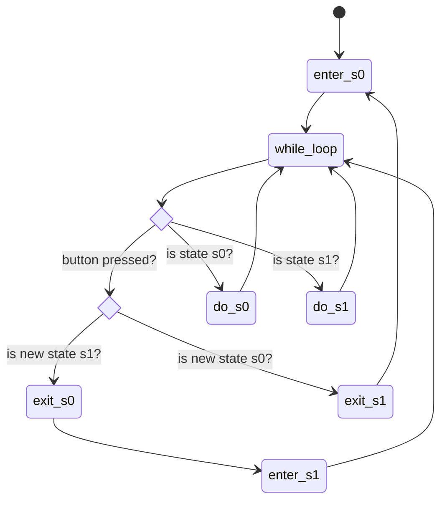

# ColorSensor
The code for an ATMEGA to interact with a color sensor to display color data.

# State Machine - Diagram

```mermaid
    stateDiagram-v2
        [*] --> enter_s0

        state next_state <<choice>>
        state current_state <<choice>>

        enter_s0 --> while_loop
        enter_s1 --> while_loop

        while_loop --> current_state
        current_state --> next_state: button pressed?
        current_state --> do_s0: is state s0?
        current_state --> do_s1: is state s1?
        do_s0 --> while_loop
        do_s1 --> while_loop
        next_state --> exit_s0: is new state s1?
        next_state --> exit_s1: is new state s0?

        exit_s0 --> enter_s1
        exit_s1 --> enter_s0
        
```